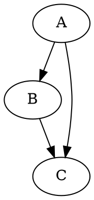

### Docusaurus
Docusaurus natively supports Mermaid, but PlantUML and Structurizr require community plugins or build-time generation. 

- PlantUML: Use a plugin like remark-kroki or similar Docusaurus PlantUML plugins that convert plantuml code blocks to images during the build process, often using a public or private PlantUML server.
- Structurizr: A dedicated docusaurus-plugin-structurizr exists to generate diagrams from Structurizr DSL files (.dsl) and embed them into your markdown pages.
- Mermaid: Docusaurus has native support for Mermaid via a simple configuration in docusaurus.config.js, making it a very seamless option. 
- 

- Site : [Docusaurus](https://Docusaurus.io/)
- Examples 
  - [This Site](https://newportg.github.io/POC-DocumentationWiki-Docusaurus)


## Markdown support in Docusaurus
GitHub Flavored Markdown (GFM) is a specific dialect of Markdown that adds features like tables and task lists, while MDX is an extension of Markdown that allows you to embed JavaScript (JSX) and components within your content. 

|Feature |	GFM|	MDX|
|--------|-------------------------------|-----------------------------------------------|
|Primary Purpose|	A robust, standardized markup language for static content, widely used on GitHub.|A way to make Markdown dynamic and interactive using JavaScript/React components.|
|Core Syntax	|Based on the CommonMark specification, with added extensions for features not found in standard Markdown.|	Based on CommonMark by default, but fundamentally extended with support for JSX.|
|Interactivity	| Primarily for static text and standard formatting.	|Highly interactive; allows embedding live demos, data visualizations, and dynamic components directly in the document.|
|Ecosystem & Tools	|Supported inherently by GitHub and widely compatible with standard Markdown parsers.	|Requires specific build tools and configurations (like those in Next.js or Gatsby) to process the embedded JSX into working code.
|GFM Features	|Includes features like tables, task lists, footnotes, and strikethrough by default.|	Does not include GFM features by default but can enable them using plugins like remark-gfm.|


In short, you can write standard and GitHub-specific Markdown syntax in both, but MDX adds the unique ability to use components and logic. If you want GFM's specific features (e.g., tables) within an MDX file, you typically need to add the appropriate plugin to your development environment's configuration. 


## Diagram Support in Docusaurus
Docusaurus has native support for several diagram formats. 

|Tool | Native | Support |
|------|----------------|----------------|
| PlantUML | No Native Support. | You can use community plugins like remark-kroki or docusaurus-plugin-plantuml to render PlantUML diagrams. These plugins typically convert PlantUML code blocks into images during the build process, often using a public or private PlantUML server. |
| Structurizr| No Native Support. | There is a dedicated docusaurus-plugin-structurizr that can generate diagrams from Structurizr DSL files (.dsl) and embed them into your markdown pages. |
| Mermaid | No Native Support.| You have to load a plugin so you can include Mermaid code blocks directly in your Markdown files, and Docusaurus will render them as diagrams. |
| Graphviz | No Native Support.| You can use community plugins like remark-kroki to render Graphviz diagrams from DOT code blocks. |

## Code Blocks
Quarto supports fenced code blocks with syntax highlighting for many programming languages. You can specify the language right after the opening backticks.

```python   
def hello_world():
    print("Hello, world!")
```

```r    
hello_world <- function() {
  print("Hello, world!")
}
```

```julia
function hello_world()
    println("Hello, world!")
end
```

## Mermaid Examples


## Graphviz Examples


## PlantUML Examples
```{.plantuml pumlfile="c4"}
```

```plantuml
@startuml 
!define AzurePuml https://raw.githubusercontent.com/RicardoNiepel/Azure-PlantUML/release/2-1/dist
!includeurl AzurePuml/AzureCommon.puml
!includeurl AzurePuml/Databases/all.puml
!includeurl AzurePuml/Compute/AzureFunction.puml

actor "Person" as personAlias
AzureFunction(functionAlias, "Label", "Technology", "Optional Description")
AzureCosmosDb(cosmosDbAlias, "Label", "Technology", "Optional Description")

personAlias --> functionAlias
functionAlias --> cosmosDbAlias
  
@enduml
```

## Structurizr Examples
```{.structurizr dslfile="software-system"}
workspace {
    model {
        user = person "User" {
            description "A user of the documentation system."
        }

        documentationSystem = softwareSystem "Documentation System" {
            description "A system for creating, editing, and viewing documentation."

            createDocs = container "Create Docs" {
                description "Allows users to create new documentation."
            }

            editDocs = container "Edit Docs" {
                description "Allows users to edit existing documentation."
            }

            viewDocs = container "View Docs" {
                description "Allows users to view documentation."
            }

            storeInGitHub = container "Store in GitHub" {
                description "Stores documentation in a GitHub repository."
            }

            renderFromGitHub = container "Render from GitHub" {
                description "Renders documentation from the GitHub repository."
            }
        }

        user -> createDocs "Creates documentation"
        user -> editDocs "Edits documentation"
        user -> viewDocs "Views documentation"
        createDocs -> storeInGitHub "Stores in"
        editDocs -> storeInGitHub "Stores in"
        viewDocs -> renderFromGitHub "Renders from"
    }

    views {
        systemContext documentationSystem {
            include *
            autolayout lr
        }

        container documentationSystem {
            include *
            autolayout lr
        }
    }
}
```

